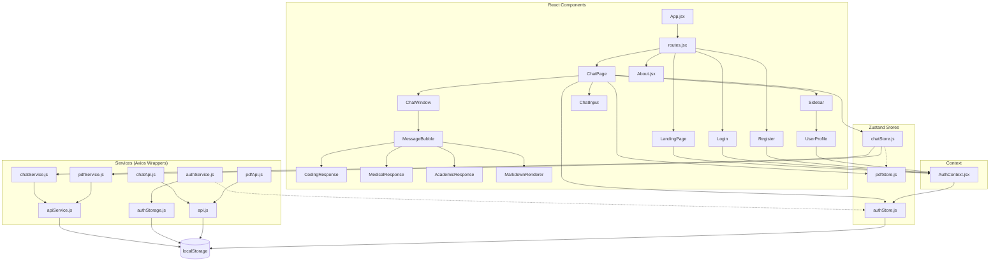
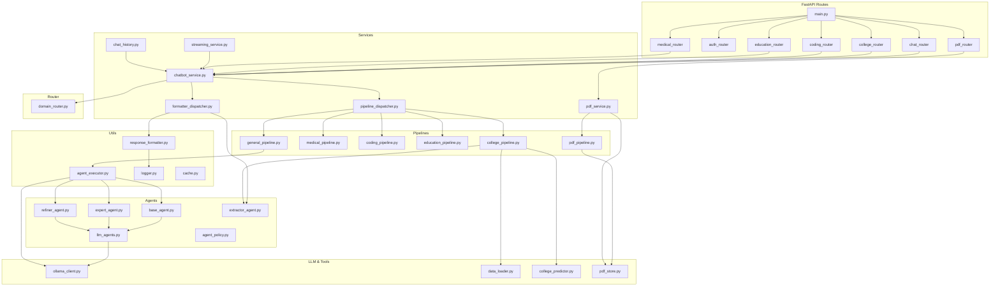

# Multi-Agent AI Chatbot — Complete Repository Architecture Audit

> **Scope:** Full recursive audit of `backend/`, `frontend/`, `agents/`, `pipelines/`, `tools/`, `llm/`, `utils/`, `schemas/`, `constants/`, `config/`, `tests/`  
> **Constraint:** Zero source code modifications.  
> **Date:** 2026-06-16

---

## Table of Contents

1. [Repository Architecture Overview](#1-repository-architecture-overview)
2. [Dependency Graph](#2-dependency-graph)
   - 2.1 [Frontend Dependency Graph](#21-frontend-dependency-graph)
   - 2.2 [Backend Dependency Graph](#22-backend-dependency-graph)
   - 2.3 [End-to-End Request Flow Trace](#23-end-to-end-request-flow-trace)
3. [High-Risk Files](#3-high-risk-files)
4. [Critical Bugs](#4-critical-bugs)
5. [Dead Code](#5-dead-code)
6. [P0 / P1 / P2 Priorities](#6-p0--p1--p2-priorities)
7. [Recommended Order of Fixes](#7-recommended-order-of-fixes)

---

## 1. Repository Architecture Overview

```
multi_agent_ai/
├── app.py                          # CLI entry point (standalone chatbot)
├── backend/
│   ├── main.py                     # FastAPI app & CORS
│   ├── api/routes/                 # FastAPI routers (auth, chat, coding, college, education, medical, pdf)
│   ├── auth/                       # JWT, password hashing, user store
│   ├── models/                     # Pydantic request/response/pdf models
│   └── services/                   # Business logic (chatbot, dispatcher, formatter, PDF, streaming, chat history)
├── frontend/
│   └── src/
│       ├── components/             # React UI components
│       ├── pages/                  # Route-level pages
│       ├── store/                  # Zustand stores (auth, chat, pdf)
│       ├── services/               # Axios wrappers & API clients
│       ├── hooks/                  # Custom React hooks
│       ├── context/                # AuthContext (proxies authStore)
│       └── utils/                  # Response mapper
├── agents/                         # Agent wrappers (base, expert, refiner, LLM agents)
├── pipelines/                      # Domain pipelines (college, medical, coding, education, general, pdf)
├── router/                         # Keyword-based domain router
├── llm/                            # Ollama synchronous HTTP client
├── tools/                          # Data loaders, college predictor, PDF store
├── utils/                          # Logger, cache, response formatter, agent executor
├── schemas/                        # Per-domain schema label definitions
├── config/                         # LLM, path, college configs
├── constants/                      # Domain constants
└── tests/                          # Pytest suite
```

### Technology Stack

| Layer | Technology |
|-------|-----------|
| Frontend | React 18, Vite, Zustand, Axios, React Router DOM |
| Backend | FastAPI, Uvicorn, Pydantic v2, PyJWT, Passlib |
| LLM | Ollama (local), `phi3:mini` default |
| Data | pandas, pdfplumber, CSV/JSON flat files |
| Auth | JWT (access + refresh), bcrypt, localStorage |

---

## 2. Dependency Graph

### 2.1 Frontend Dependency Graph



### 2.2 Backend Dependency Graph



### 2.3 End-to-End Request Flow Trace

```
User Types Query
│
├─► React Component (ChatPage.jsx)
│   ├─► Zustand Store (chatStore.js)
│   │   ├─► chatService.js ──► apiService.js (Axios instance)
│   │   │   ├─► Base URL: http://localhost:8000
│   │   │   ├─► Request interceptor attaches Authorization: Bearer <token>
│   │   │   └─► Response interceptor handles 401 → logout
│   │   └─► Or pdfService.js ──► apiService.js
│   │       └─► PDF endpoints: POST /pdf/upload, POST /pdf/ask, DELETE /pdf/clear
│   └─► useAuthStore (bypasses AuthContext)
│
├─► Axios POST /chat (or /college, /medical, /coding, /education)
│
├─► FastAPI Route (backend/api/routes/chat.py)
│   ├─► Auth Dependency: verify JWT token (backend/auth/auth_dependency.py)
│   │   └─► jwt_service.py → decode_token → PyJWT
│   ├─► Parse request model (backend/models/request_models.py)
│   └─► Call chatbot_service.process_query()
│
├─► chatbot_service.py
│   ├─► Domain Router (router/domain_router.py) → keyword scoring
│   ├─► Pipeline Dispatcher (backend/services/pipeline_dispatcher.py)
│   │   ├─► Maps domain → pipeline function
│   │   ├─► On Exception: fallback to general_pipeline
│   │   └─► Returns PipelineResult
│   └─► Formatter Dispatcher (backend/services/formatter_dispatcher.py)
│       ├─► If PipelineResult.data exists → return data.model_dump()
│       └─► Else → parse formatted string via response_formatter.py
│
├─► Pipeline (e.g., coding_pipeline.py)
│   ├─► Calls LLM via call_llm() (llm/ollama_client.py)
│   ├─► Uses agent_executor.py for multi-agent chains:
│   │   ├─► base_agent → refiner_agent (if medium/high) → expert_agent (if high)
│   │   └─► Each agent calls llm_agents.py, which calls call_llm()
│   ├─► Formats response via section labels (schemas/*.py)
│   └─→ Returns PipelineResult(response, data)
│
├─► call_llm() ──► requests.Session().post() → Ollama API (/api/generate)
│   ├─► Synchronous blocking call (no async support)
│   └─► Retry logic on RuntimeError
│
├─► Response flows back:
│   PipelineResult → formatter_dispatcher → ChatResponse → FastAPI JSONResponse
│
├─► Axios receives JSON → apiService.js response interceptor
│   └─► chatService.js → mapChatResponse() (utils/responseMapper.js)
│
└─► Zustand store updates → React re-renders MessageBubble
    ├─► Domain-specific renderer: CodingResponse | MedicalResponse | AcademicResponse | MarkdownRenderer
    └─► CopyResponseButton (unused)
```

### Key Architectural Boundary Violations

| Violation | From | To | Impact |
|-----------|------|-----|--------|
| Service → Agent | `formatter_dispatcher.py` | `agents/extractor_agent.py` | Service layer should not depend on agent layer |
| Store → Store | `chatStore.js` | `usePdfStore.getState()` | Cross-store coupling breaks separation of concerns |
| Dual API Clients | `api.js` + `apiService.js` | Both use Axios | Broken token interceptor in `api.js` (`user.token` instead of `user.access_token`) |
| Context Bypass | `ChatPage.jsx` | `useAuthStore` directly | Inconsistent auth consumption pattern |
| Sync LLM in Async App | FastAPI endpoints | `ollama_client.call_llm` | Blocks ASGI event loop for 5-30s per call |

---

## 3. High-Risk Files

| Rank | File | Risk | Rationale |
|------|------|------|-----------|
| 1 | `backend/api/routes/chat.py` | **Crash on every chat detail endpoint** | `_format_chat_detail()` spreads `**chat` including `"id"` into `ChatDetailResponse` which has `extra="forbid"`. Every `POST /chats`, `GET /chats/{id}`, and `POST /chats/{id}/messages` returns HTTP 500. |
| 2 | `backend/services/chatbot_service.py` | **Unhandled 500s** | Docstring promises "never raises" but has zero try/except. Any pipeline/formatter failure propagates as uncaught 500. |
| 3 | `backend/api/routes/pdf.py` | **Path traversal + sync blocking** | `upload_pdf` and `load_pdf_by_path` accept raw file paths with no sanitization. Also, sync PDF parsing blocks the event loop inside async handlers. |
| 4 | `backend/auth/jwt_service.py` | **Weak default secret + refresh abuse** | Hardcoded fallback secret `"supersecretkey-dev-only"`. No `type` claim distinction means stolen access tokens can be redeemed at `/auth/refresh`. |
| 5 | `utils/response_formatter.py` | **Runtime NameError** | Uses undefined `_SUGGESTION_PATTERN` (line 148) and `_CODE_PATTERN` (line 207). Will crash on coding clarifications or code blocks. |
| 6 | `pipelines/coding_pipeline.py` | **Runtime NameError** | Uses undefined `_CODE_PATTERN` (line 271). Will crash when parsing code sections from LLM output. |
| 7 | `frontend/src/services/api.js` | **Broken auth interceptor** | Checks `user?.token` but stored key is `access_token`. Authorization header is never attached. Unused in production, but if reactivated, all requests are unauthenticated. |
| 8 | `frontend/src/store/chatStore.js` | **Schema mismatch (empty messages)** | Saves messages with `content` key, but `MessageBubble` expects `text`. Bot messages may render empty. Also directly reaches into `pdfStore`. |
| 9 | `llm/ollama_client.py` | **Event loop blocking** | Entirely synchronous `requests.Session().post()`. Every API call that triggers a pipeline blocks all other concurrent requests. |
| 10 | `backend/auth/user_store.py` | **Hardcoded admin + case bug** | Ships a default admin account with pre-computed hash. `create_user` stores raw-case username while lookups lowercase it, creating unreachable accounts. |

---

## 4. Critical Bugs

### P0 — Runtime Crashes & Security

| # | File | Line(s) | Issue |
|---|------|---------|-------|
| 1 | `backend/api/routes/chat.py` | 20, 30, 36, 52 | `_format_chat_detail()` passes `"id"` key into `ChatDetailResponse` with `extra="forbid"` → ValidationError → HTTP 500 on all chat detail endpoints. |
| 2 | `utils/response_formatter.py` | 148 | `_SUGGESTION_PATTERN` is **undefined** → `NameError` when formatting coding clarifications. |
| 3 | `utils/response_formatter.py` | 207 | `_CODE_PATTERN` is **undefined** → `NameError` when formatting coding responses with code blocks. |
| 4 | `pipelines/coding_pipeline.py` | 271 | `_CODE_PATTERN` is **undefined** → `NameError` when parsing code sections from LLM output. |
| 5 | `backend/api/routes/pdf.py` | 43 | `load_pdf_by_path` accepts raw `request.path` with no traversal validation → path traversal vulnerability. |
| 6 | `backend/api/routes/pdf.py` | 95 | `upload_pdf` uses `os.path.join(UPLOAD_DIR, file.filename)` with unsanitized filename → path traversal vulnerability. |
| 7 | `backend/auth/jwt_service.py` | 13 | Default `SECRET_KEY = "supersecretkey-dev-only"` if env var missing → trivially forgeable tokens. |
| 8 | `backend/auth/jwt_service.py` | 27-35 | `create_access_token` and `create_refresh_token` have identical payload (no `type` claim) → access tokens can be used at `/auth/refresh`. |
| 9 | `backend/api/routes/auth.py` | 80 | Refresh endpoint does not verify the submitted token is a refresh token. |
| 10 | `backend/services/chatbot_service.py` | 38 | Function promises "never raises" in docstring but contains **zero** exception handling. Any pipeline/formatter failure becomes unhandled 500. |
| 11 | `backend/services/pipeline_dispatcher.py` | 58-66 | Catches any pipeline failure, then calls `general_pipeline` (second LLM call), then catches again and re-raises. Wastes an LLM call before failing. |
| 12 | `frontend/src/services/api.js` | 14 | Token interceptor checks `user?.token` but key is `access_token` → Authorization header never attached. |

### P1 — Functional Defects & Broken Contracts

| # | File | Line(s) | Issue |
|---|------|---------|-------|
| 13 | `backend/models/response_models.py` | 113 | `@field_validator("text", mode="before")` may not run when `text` key is entirely missing from dict; fallback to `content` silently fails. |
| 14 | `backend/api/routes/chat.py` | 89 | Returns `domain="unknown"` in error path, but `ChatResponse.domain` is `DomainType` Literal that does not include `"unknown"` → validation error → 500. |
| 15 | `backend/services/formatter_dispatcher.py` | 54 | Bare `except Exception` around formatter hides real bugs. |
| 16 | `backend/services/pipeline_dispatcher.py` | 35-39 | `pdf_pipeline` is **not registered** in `_PIPELINES`. PDF domain unreachable via standard chat flow. |
| 17 | `router/domain_router.py` | (all) | No PDF keywords. Brittle keyword overlap between coding and education domains (e.g., "binary tree", "java", "algorithm" score for both). |
| 18 | `frontend/src/components/MessageBubble.jsx` | 55 | Bot fallback path uses `text` but ignores `content`. If backend returns `content`, bot bubble renders empty. |
| 19 | `frontend/src/store/chatStore.js` | 60-65, 129-137 | `loadChat` stores `data.messages` directly from backend (may have `content` key). `submitMessage` saves bot response with `content` key. `MessageBubble` expects `text`. |
| 20 | `backend/models/response_models.py` | 176-195 | Duplicate PDF models defined but never used (superseded by `pdf_models.py`). |
| 21 | `backend/auth/jwt_service.py` | 22, 28, 29, 36, 37 | Uses deprecated `datetime.utcnow()` (Python 3.12+ deprecation warning). |
| 22 | `backend/auth/auth_dependency.py` | 31 | Catch-all `except Exception` converts `MemoryError`, `OSError`, etc. into generic 401, masking real system issues. |
| 23 | `agents/base_agent.py`, `expert_agent.py`, `refiner_agent.py` | 1 | UTF-8 BOM (`U+FEFF`) at start of files → potential import issues on some systems. |
| 24 | `utils/agent_executor.py` | 97-113 | Refiner and expert exceptions are logged and **swallowed**, returning the previous result silently. |
| 25 | `pipelines/general_pipeline.py` | 137 | Broad `except Exception` silently falls back to direct LLM call, hiding agent chain failures. |

### P2 — Maintainability & Performance Debt

| # | File | Line(s) | Issue |
|---|------|---------|-------|
| 26 | `frontend/src/services/api.js` + `apiService.js` | (all) | Two competing Axios instances with different error-handling strategies. `api.js` is unused but broken; `apiService.js` is production client. |
| 27 | `frontend/src/services/chatApi.js` + `pdfApi.js` | (all) | Completely unused service layers. Duplicated by `chatService.js` and `pdfService.js`. |
| 28 | `frontend/src/hooks/useChat.js` + `usePdf.js` | (all) | Completely unused hooks. `ChatPage` uses Zustand stores directly. |
| 29 | `frontend/src/components/RequireAuth.jsx` | (all) | Unused standalone component; `routes.jsx` defines its own inline `RequireAuth`. |
| 30 | `frontend/src/pages/About.jsx` + `Navbar.jsx` + `CopyResponseButton.jsx` | (all) | No route for `/about`; Navbar only imported by About; CopyResponseButton never imported. All dead. |
| 31 | `agents/base_agent.py`, `expert_agent.py`, `refiner_agent.py` | (all) | Pure pass-through wrappers to `llm_agents.py`. Dead abstraction. |
| 32 | `backend/auth/token_models.py` | 7 | `Token` model exported but never used anywhere. |
| 33 | `backend/services/chatbot_service.py` | 21, 30 | `INTERNAL_ERROR_MESSAGE` constant compared against pipeline output, but pipeline never returns this string → dead branch. |
| 34 | `backend/services/chat_history.py` | 12 | In-memory dict storage for chat history → all history lost on server restart. |
| 35 | `llm/ollama_client.py` | (all) | Entirely synchronous `requests.Session()` with no async counterpart. Blocks FastAPI event loop for full LLM latency. |
| 36 | `utils/agent_executor.py` | (all) | Sequential LLM calls (base → refiner → expert). 3 calls × 5-30s = 15-90s latency for high-complexity queries. No batching or parallelization. |
| 37 | `pipelines/college_pipeline.py`, `coding_pipeline.py`, `education_pipeline.py`, `medical_pipeline.py`, `pdf_pipeline.py` | (all) | `_DIVIDER = "─" * 55` duplicated in every pipeline file. |
| 38 | `backend/api/routes/pdf.py` | 79 | Async handler `upload_pdf` calls synchronous `load_pdf()` without `asyncio.to_thread()`, blocking the loop. |
| 39 | `backend/api/routes/chat.py` | 133 | `chat_stream` calls synchronous `process_query()` without thread pool, blocking the loop. |
| 40 | `frontend/src/store/authStore.js` | 16, 31-44 | Tokens stored in `localStorage` (XSS risk). `verifySession()` never validates token with backend. `refreshToken()` defined but never called. |
| 41 | `frontend/src/pages/Login.jsx` / `Register.jsx` | 116-118 / 135-137 | "Chat as Guest" link goes to `/chat` which is protected by `RequireAuth` → immediate redirect to `/login`. Misleading UX. |
| 42 | `frontend/src/pages/ChatPage.jsx` | 29-32 | Duplicate auth guard: `useEffect` redirects if `!user`, but `routes.jsx` already wraps `/chat` in `RequireAuth`. |
| 43 | `frontend/src/index.css` | 25 | `flex-col: true;` is invalid CSS. |
| 44 | `schemas/general_schema.py` | (all) | `GENERAL_LABELS = {}` (empty dict) — never imported by any pipeline or formatter. |
| 45 | `schemas/college_schema.py` | (all) | `COLLEGE_LABELS` defined but `college_pipeline.py` does not use `parse_sections` at all. Labels only used by legacy formatter. |
| 46 | `pipelines/coding_pipeline.py` | 281 | `tip` parsed from LLM output but never assigned to `CodingData` — insight is lost. |
| 47 | `config/llm_config.py` | (all) | Hardcoded `OLLAMA_URL = "http://localhost:11434"` with no env override. |
| 48 | `tools/detect_cycles.py` | (all) | Performs filesystem walk + AST parsing at **import time** — side effect on every import. |

---

## 5. Dead Code

### Completely Unused Files

| File | Reason |
|------|--------|
| `frontend/src/components/RequireAuth.jsx` | Inline `RequireAuth` defined in `routes.jsx` |
| `frontend/src/components/CopyResponseButton.jsx` | Never imported |
| `frontend/src/components/Navbar.jsx` | Only imported by unreachable `About.jsx` |
| `frontend/src/pages/About.jsx` | No route exists; `/about` caught by `*` redirect |
| `frontend/src/hooks/useChat.js` | `ChatPage` uses Zustand directly |
| `frontend/src/hooks/usePdf.js` | `ChatPage` uses Zustand directly |
| `frontend/src/services/chatApi.js` | Never imported; `chatService.js` used instead |
| `frontend/src/services/pdfApi.js` | Never imported; `pdfService.js` used instead |
| `frontend/src/services/chatService.js` | Functions `askCoding`, `askEducation`, `askMedical`, `predictCollege` are unused thin wrappers |
| `backend/auth/token_models.py` | `Token` model never imported |
| `backend/models/response_models.py:176-195` | PDF model duplicates superseded by `pdf_models.py` |
| `schemas/general_schema.py` | Empty `GENERAL_LABELS`, never imported |

### Unused / Orphaned Functions & Variables

| File | Line | Item | Reason |
|------|------|------|--------|
| `backend/services/chatbot_service.py` | 21 | `INTERNAL_ERROR_MESSAGE` | Compared against pipeline output, but pipeline never returns it |
| `backend/services/chatbot_service.py` | 30 | `if response == INTERNAL_ERROR_MESSAGE` | Dead branch |
| `backend/api/routes/pdf.py` | 31 | `_postprocess_pdf_task` | No-op placeholder passed to `background_tasks.add_task` |
| `frontend/src/pages/ChatPage.jsx` | 24-25 | `searchQuery`, `setSearchQuery` | No search UI exists |
| `frontend/src/services/authService.js` | 38 | `getToken()` fallback `user?.token` | Key is always `access_token` |

### Temporary Debug Files (should be removed from VCS)

| File | Content |
|------|---------|
| `tmp_auth_register_test.py` | Auth registration debug script |
| `tmp_auth_route_debug.py` | Auth route debug script |
| `tmp_chat_debug.py` | Chat debug script |
| `tmp_cors_auth_test.py` | CORS/auth test script |
| `tmp_passlib_check.py` | Passlib compatibility check |

---

## 6. P0 / P1 / P2 Priorities

### P0 — Fix Immediately (Runtime Crash / Security)

| ID | Issue | File(s) | Lines | Fix Complexity |
|----|-------|---------|-------|----------------|
| P0-1 | Chat detail endpoints crash on extra `"id"` field | `backend/api/routes/chat.py` | 20, 30, 36, 52 | Low |
| P0-2 | `_SUGGESTION_PATTERN` undefined → NameError | `utils/response_formatter.py` | 148 | Low |
| P0-3 | `_CODE_PATTERN` undefined → NameError | `utils/response_formatter.py` | 207 | Low |
| P0-4 | `_CODE_PATTERN` undefined → NameError | `pipelines/coding_pipeline.py` | 271 | Low |
| P0-5 | Path traversal in PDF load-by-path | `backend/api/routes/pdf.py` | 43 | Low |
| P0-6 | Path traversal in PDF upload | `backend/api/routes/pdf.py` | 95 | Low |
| P0-7 | Weak default JWT secret | `backend/auth/jwt_service.py` | 13 | Low |
| P0-8 | No token-type distinction (refresh abuse) | `backend/auth/jwt_service.py` | 27-35 | Low |
| P0-9 | Chatbot service promises safety but has no try/except | `backend/services/chatbot_service.py` | 38 | Medium |

### P1 — Fix Soon (Broken Contracts / Functional Defects)

| ID | Issue | File(s) | Lines | Fix Complexity |
|----|-------|---------|-------|----------------|
| P1-10 | `domain="unknown"` not in Literal → 500 | `backend/api/routes/chat.py` | 89 | Low |
| P1-11 | `text` field validator fails when key missing | `backend/models/response_models.py` | 113 | Low |
| P1-12 | `pdf_pipeline` not registered in dispatcher | `backend/services/pipeline_dispatcher.py` | 35-39 | Low |
| P1-13 | PDF domain missing from keyword router | `router/domain_router.py` | (all) | Medium |
| P1-14 | Bot message `content` vs `text` mismatch | `frontend/src/store/chatStore.js` + `MessageBubble.jsx` | 60-65, 55 | Medium |
| P1-15 | Broken token interceptor (`user.token`) | `frontend/src/services/api.js` | 14 | Low |
| P1-16 | UTF-8 BOM in agent wrapper files | `agents/base_agent.py`, `expert_agent.py`, `refiner_agent.py` | 1 | Low |
| P1-17 | Swallowed exceptions in agent executor | `utils/agent_executor.py` | 97-113 | Medium |
| P1-18 | `datetime.utcnow()` deprecated | `backend/auth/jwt_service.py` | 22-37 | Low |

### P2 — Fix When Convenient (Debt / Performance / Cleanup)

| ID | Issue | File(s) | Lines | Fix Complexity |
|----|-------|---------|-------|----------------|
| P2-19 | Remove duplicate Axios client `api.js` | `frontend/src/services/api.js` | (all) | Low |
| P2-20 | Remove unused hooks `useChat.js`, `usePdf.js` | `frontend/src/hooks/` | (all) | Low |
| P2-21 | Remove unused pages/components | `About.jsx`, `Navbar.jsx`, `CopyResponseButton.jsx`, `RequireAuth.jsx` | (all) | Low |
| P2-22 | Remove pass-through agent wrappers | `agents/base_agent.py`, `expert_agent.py`, `refiner_agent.py` | (all) | Medium |
| P2-23 | Remove temporary debug files | `tmp_*.py` (5 files) | (all) | Low |
| P2-24 | Make `call_llm` async or use thread pool | `llm/ollama_client.py` | (all) | Medium |
| P2-25 | Parallelize agent chain LLM calls | `utils/agent_executor.py` | (all) | High |
| P2-26 | Replace in-memory chat history with persistent store | `backend/services/chat_history.py` | 12 | Medium |
| P2-27 | Move tokens from localStorage to httpOnly cookies | `frontend/src/store/authStore.js` | 16 | Medium |
| P2-28 | Deduplicate `_DIVIDER` constant | 5 pipeline files | (all) | Low |
| P2-29 | Fix duplicate auth guard on ChatPage | `frontend/src/pages/ChatPage.jsx` | 29-32 | Low |
| P2-30 | Sanitize CORS defaults for production | `backend/main.py` | 62-77 | Low |

---

## 7. Recommended Order of Fixes

### Week 1 — Stop the Bleeding (P0)

1. **Fix chat detail endpoint crash** (`chat.py` line 20) — strip `"id"` before spreading into response model.
2. **Fix undefined regex patterns** (`response_formatter.py` lines 148, 207; `coding_pipeline.py` line 271) — define `_SUGGESTION_PATTERN` and `_CODE_PATTERN`.
3. **Fix path traversal** (`pdf.py` lines 43, 95) — use `secure_filename` or `os.path.basename()` + directory containment checks.
4. **Fix JWT security** (`jwt_service.py` lines 13, 27-35) — require env `JWT_SECRET_KEY`, add `"type": "access"` / `"type": "refresh"` claims, validate type on refresh.
5. **Add exception handling to chatbot_service** (`chatbot_service.py` line 38) — wrap `route_domain`, `dispatch_pipeline`, `dispatch_formatter` in try/except and return `ChatResponse(success=False, ...)`.

### Week 2 — Restore Functionality (P1)

6. **Fix PDF pipeline registration** (`pipeline_dispatcher.py` lines 35-39) — add `PDF_DOMAIN` → `pdf_pipeline` mapping.
7. **Add PDF keywords to domain router** (`domain_router.py`) — add "pdf", "document", "page" keywords.
8. **Fix `domain="unknown"` schema mismatch** (`chat.py` line 89) — return a valid `DomainType` literal or remove the field from error responses.
9. **Fix `text`/`content` schema mismatch** (`chatStore.js` + `MessageBubble.jsx`) — standardize on one key or handle both.
10. **Fix swallowed exceptions** (`agent_executor.py` lines 97-113) — re-raise or return explicit failure objects instead of silently returning previous results.
11. **Remove UTF-8 BOMs** from agent wrapper files.

### Week 3 — Clean Up & Harden (P2)

12. **Delete dead code** (`api.js`, unused hooks/pages, pass-through agent wrappers, `tmp_*.py` debug files, duplicate PDF models).
13. **Refactor duplicate Axios clients** — consolidate on `apiService.js` with proper interceptors.
14. **Make LLM calls non-blocking** — wrap `call_llm` with `asyncio.to_thread()` or build an async client.
15. **Add persistent chat history** — replace in-memory dict with SQLite/Redis.
16. **Move JWT to httpOnly cookies** — eliminate localStorage XSS risk.
17. **Parallelize agent chain** — run refiner + expert in `asyncio.gather()` where possible.
18. **Consolidate `_DIVIDER` and section labels** — move to shared constants module.

---

*End of Audit Report*
