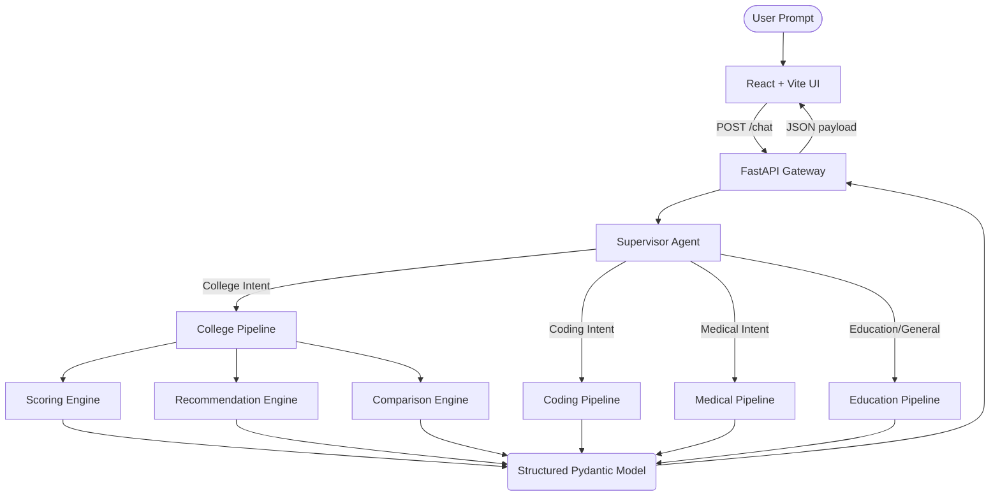

# Multi-Agent AI Problem Solving Assistant

<div align="center">


*An intelligent, highly scalable platform combining autonomous LLM agents with a modern React frontend to deliver specialized counseling, coding, medical, and educational intelligence.*

</div>

---

## Overview

This project implements a powerful **Multi-Agent Architecture** built with **FastAPI** on the backend and **React + Vite** on the frontend. Rather than relying on a single monolithic LLM prompt, the system intelligently routes natural language queries to highly specialized domain agents (College Counselor, Medical AI, Coding Assistant, Education AI).

A standout feature is the **AI College Counseling Platform**, which transforms raw metadata from engineering colleges into highly personalized, explainable recommendations—calculating ROI scores, student match percentages, and deep campus life analysis.

---

## Key Features

- **Multi-Agent Domain Routing**: A Supervisor Agent classifies incoming prompts and delegates tasks to specialized domain pipelines.
- **AI College Counseling Platform**: Dynamically predicts safe, moderate, and dream colleges based on rank, computing advanced match scores and AI-driven explanations.
- **Coding Assistant**: Automatically formats code snippets, calculates algorithmic complexity, and explains logic.
- **Specialized AI Pipelines**: Dedicated pipelines structure complex medical and educational information into safe, digestible JSON payloads.
- **Performance Optimized**: Built with strict Pydantic validation, memory caching (`functools.lru_cache`), and robust error handling to maintain sub-second response times.
- **Modern UI/UX**: Responsive React frontend featuring clean typography, lucide-react icons, and distinct visual cards mapped perfectly to backend Pydantic models.

---

## Architecture

The system utilizes a modular, multi-agent workflow to ensure scalability and domain specificity.



<details>
<summary><b>Click here to view the step-by-step Multi-Agent Workflow</b></summary>

1. **Extraction Phase**: A dedicated extractor agent parses the user's natural language to extract core parameters (e.g., student rank, category, branch preference).
2. **Routing Phase**: The router analyzes the intent and selects the perfect pipeline (College, Coding, Medical, etc.).
3. **Execution Phase**: The chosen pipeline orchestrates data fetching, scoring engines, and LLM text generation.
4. **Validation Phase**: Pydantic strictly validates the exact payload structure before returning it.
5. **Rendering Phase**: The React frontend dynamically mounts the correct component based on the detected domain type.

</details>

---

## Folder Structure

The repository is divided cleanly into an API-driven backend and a React client.

<details>
<summary><b>View Repository Structure</b></summary>

```text
.
├── backend/
│   ├── models/            # Pydantic request/response models
│   └── services/          # Pure-function engines (Scoring, Recommendations, Comparisons)
├── pipelines/             # Orchestrators for each specific AI domain
├── agents/                # Prompts and LLM interaction logic
├── tools/                 # Utilities like metadata_loader and predictors
├── data/                  # Static metadata (e.g., college_metadata.json)
├── frontend/              # React + Vite UI application
├── router/                # FastAPI routing definitions
├── tests/                 # Pytest test suites
├── app.py                 # FastAPI application entry point
└── requirements.txt       # Python dependencies
```

</details>

---

## Installation & Setup

### 1. Clone the repository
```bash
git clone https://github.com/username/multi-agent-ai.git
cd multi-agent-ai
```

### 2. Backend Setup
Create a virtual environment and install dependencies:
```bash
python -m venv .venv

# On Windows
.venv\Scripts\activate
# On Mac/Linux
source .venv/bin/activate

pip install -r requirements.txt
```

### 3. Frontend Setup
```bash
cd frontend
npm install
```

### 4. Environment Variables
Create a `.env` file in the root directory based on `.env.example`:
```env
# Example .env
GEMINI_API_KEY=your_google_gemini_api_key
ENVIRONMENT=development
CORS_ORIGINS=http://localhost:5173
```

---

## Running the Project

To run both servers, open two terminal windows:

**Terminal 1 (Backend):**
```bash
uvicorn app:app --reload
```
The FastAPI server will start on `http://127.0.0.1:8000`. API documentation is available at `http://127.0.0.1:8000/docs`.

**Terminal 2 (Frontend):**
```bash
cd frontend
npm run dev
```
The React app will be available at `http://localhost:5173`.

---

## Visuals

| Home Interface | Interactive Chat |
| :---: | :---: |
|  |  |

### AI College Counseling Platform

<div align="center">
  
</div>

*The College Counseling Platform transforms raw engineering college data into highly personalized recommendations, rendering custom React cards with clear ROI indicators and deep strength/weakness analysis.*

---

## Testing

Backend unit tests are written using `pytest`. To run the full suite:

```bash
pytest tests/ -v
```

---

## Contributing

Contributions, issues, and feature requests are welcome. Feel free to check the issues page if you want to contribute.

1. Fork the Project
2. Create your Feature Branch (`git checkout -b feature/AmazingFeature`)
3. Commit your Changes (`git commit -m 'Add some AmazingFeature'`)
4. Push to the Branch (`git push origin feature/AmazingFeature`)
5. Open a Pull Request

---

## License

Distributed under the MIT License. See `LICENSE` for more information.
