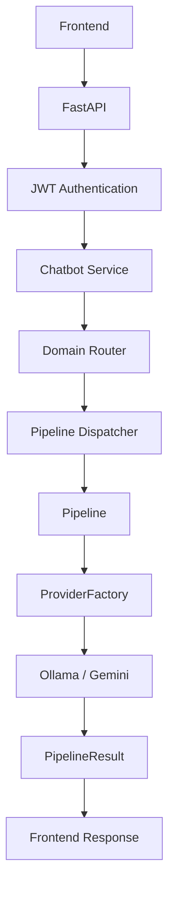

# Multi-Agent AI Problem Solving Assistant

<div align="center">


*An intelligent, highly scalable platform combining autonomous LLM agents with a modern React frontend to deliver specialized counseling, coding, medical, and educational intelligence.*

</div>

---

## 📖 Overview

This project implements a powerful **Multi-Agent Architecture** built with **FastAPI** on the backend and **React + Vite** on the frontend. Rather than relying on a single monolithic LLM prompt, the system intelligently routes natural language queries to highly specialized domain agents.

A standout feature is the **AI College Counseling Platform**, which transforms raw metadata from engineering colleges into highly personalized, explainable recommendations—calculating ROI scores, student match percentages, and deep campus life analysis.

---

## 🚀 Key Features

- **Multi-Agent Domain Routing**: A Domain Router classifies incoming prompts and delegates tasks to specialized pipelines.
- **AI College Counseling Platform**: Dynamically predicts safe, moderate, and dream colleges based on rank, computing advanced match scores and AI-driven explanations.
- **Provider Architecture**: Seamlessly scales across LLMs (Google Gemini, Ollama) via a robust `ProviderFactory` singleton.
- **Gemini Enhancement Layer**: An aggressive caching and token-optimization layer specifically built for Google Gemini integration.
- **Specialized AI Pipelines**: Dedicated pipelines structure complex responses into strictly validated Pydantic models (PipelineResult).
- **Modern UI/UX**: Fully responsive React frontend featuring clean typography, glassmorphism authentication, Zustand state management, and real-time comparison tables.

---

## 🏗️ Architecture

### High-Level System Architecture



### AI Architecture
- **Multi-Agent System**: specialized agents for medical, coding, college, and education.
- **Resume Parser:** Upload PDFs and run deterministic skills matching without Gemini interference.
- **Export Capabilities:** Export data into dynamically resolvable formats via the `ExporterRegistry` (PDF and JSON currently supported; CSV and DOCX extendable).
- **Observability:** Tracks business intelligence events via the structured SQLite UsageTracker schema (events, api_metrics, pipeline_metrics, daily_metrics).
- **Frontend Architecture:** Semantic Toast UI framework, robust `useExport` hooks orchestrating API queries safely decoupled from UI rendering, and centralized profile persistence.
- **Ollama**: Localized LLM provider for secure inference.
- **Gemini Enhancement Layer**: Caching and token optimization for Google Gemini.
- **ProviderFactory**: Orchestrates model execution and fallback.
- **Prompt Loader**: Manages system prompts dynamically.
- **Metadata Refresh Engine**: Updates college data dynamically.
- **Recommendation Engine**: Suggests optimized outcomes based on user data.
- **Scoring Engine**: Evaluates metrics mathematically.
- **Comparison Engine**: Prepares direct entity comparisons.
- **PipelineResult**: Enforces structured JSON Pydantic contracts for every output.
- **JWT Authentication**: Protects the API layer securely.
- **Chat History**: Manages ongoing conversational context.

---

## 🎓 College Counseling Workflow

1. **Extraction Phase**: A dedicated extractor agent parses the user's natural language to identify student parameters.
2. **Prediction Phase**: The prediction engine queries local metadata to find realistically attainable institutions based on historical cutoffs.
3. **Scoring Phase**: Calculates financial ROI, NAAC/NIRF normalization, and lifestyle match scores.
4. **Comparison Phase**: Injects a strictly formatted payload to allow the React frontend to natively render 1-to-1 statistics.

---

## 📸 Screenshots

| Home Interface | Authentication |
| :---: | :---: |
|  |  |

| Registration | Interactive Chat |
| :---: | :---: |
|  |  |

### Specialized UI Renderings

| College Prediction Card | Dynamic Comparison Engine |
| :---: | :---: |
|  |  |

<div align="center">
  
  <br><i>Performance Metrics & Dashboard</i>
</div>

---

## 📂 Folder Structure

```text
.
├── backend/
│   ├── api/routes/        # FastAPI route controllers
│   ├── auth/              # JWT, hashing, and User models
│   ├── cache/             # SQLite Gemini cache and optimization
│   ├── models/            # Pydantic schema validation
│   ├── observability/     # Telemetry and logging
│   ├── prompts/           # LLM Prompt Loader templates
│   ├── providers/         # ProviderFactory, Ollama, Gemini integrations
│   └── services/          # Engines (Scoring, Comparison, Recommendation)
├── frontend/              
│   ├── src/
│   │   ├── components/    # Reusable React components
│   │   ├── context/       # React Context
│   │   ├── hooks/         # Custom React hooks
│   │   ├── pages/         # High-level route pages
│   │   ├── store/         # Zustand global state management
│   │   └── utils/         # Reusable validation and formatting
├── docker-compose.yml     # Container orchestration
├── Dockerfile             # Backend Dockerfile
└── requirements.txt       # Python dependencies
```

---

## ⚙️ Installation & Setup

### 1. Clone the repository
```bash
git clone https://github.com/username/multi-agent-ai.git
cd multi-agent-ai
```

### 2. Backend Setup
Create a virtual environment and install dependencies:
```bash
python -m venv .venv

# On Windows
.venv\Scripts\activate
# On Mac/Linux
source .venv/bin/activate

pip install -r requirements.txt
```

### 3. Frontend Setup
```bash
cd frontend
npm install
```

### 4. Environment Variables
Create a `.env` file in the root directory based on `.env.example`:
```env
# Example .env
GEMINI_API_KEY=your_google_gemini_api_key
JWT_SECRET_KEY=your_jwt_secret_key
ENVIRONMENT=development
CORS_ORIGINS=http://localhost:5173
```

---

## 🐳 Docker Deployment

The fastest way to deploy the entire stack is via Docker Compose.

```bash
docker-compose up --build -d
```
- The FastAPI backend will bind to `http://localhost:8000`
- The Vite frontend will bind to `http://localhost:80`

---

## 🔌 API Architecture

The REST API isolates concerns into dedicated domains:
- `/api/v1/auth`: JWT Login, Registration, Token Refresh.
- `/api/v1/chat`: Managing Chat Sessions, History, and Streaming standard completions.
- `/api/v1/college`, `/api/v1/coding`, `/api/v1/medical`, `/api/v1/education`: Specialized domain routes.
- `/api/v1/pdf`: RAG and document context endpoints.

---

## ⚡ Performance

The backend incorporates multiple performance optimizations:
- **Provider abstraction**: Dynamically allocates payloads across providers seamlessly.
- **SQLite Gemini cache**: Aggressively captures repeated queries to eliminate redundant API latency.
- **Prompt caching**: Keeps heavy system prompts in memory for instantaneous execution.
- **Thread-safe ProviderFactory**: Handles high concurrency via Singleton pattern mapping.
- **Hybrid Rule + LLM classifier**: Identifies domains rapidly without solely depending on LLM parsing.
- **Structured PipelineResult**: Ensures stable parser decoding with enforced Pydantic extraction.
- **Metadata versioning**: The Metadata Refresh Engine actively serves the latest datasets without memory restarts.

---

## 🧪 Testing

Testing is implemented rigorously utilizing the `pytest` framework.
- **Backend tests exist**: Validating API routes, domain routing, services, and models.
- **Current test count**: 196 active tests.
- **Unit & Integration tests**: Includes isolated unit checks and end-to-end integration scenarios.

Run the test suite locally:
```bash
pytest tests/ -v
```

---

## 🗺️ Roadmap

Planned features and future implementations:
- [ ] GitHub Actions for CI/CD automation.
- [ ] Retrieval-Augmented Generation (RAG) context enhancements.
- [ ] Voice Support for real-time dictation.
- [ ] Compare Improvements for visual graphs.
- [ ] Scholarship Engine.
